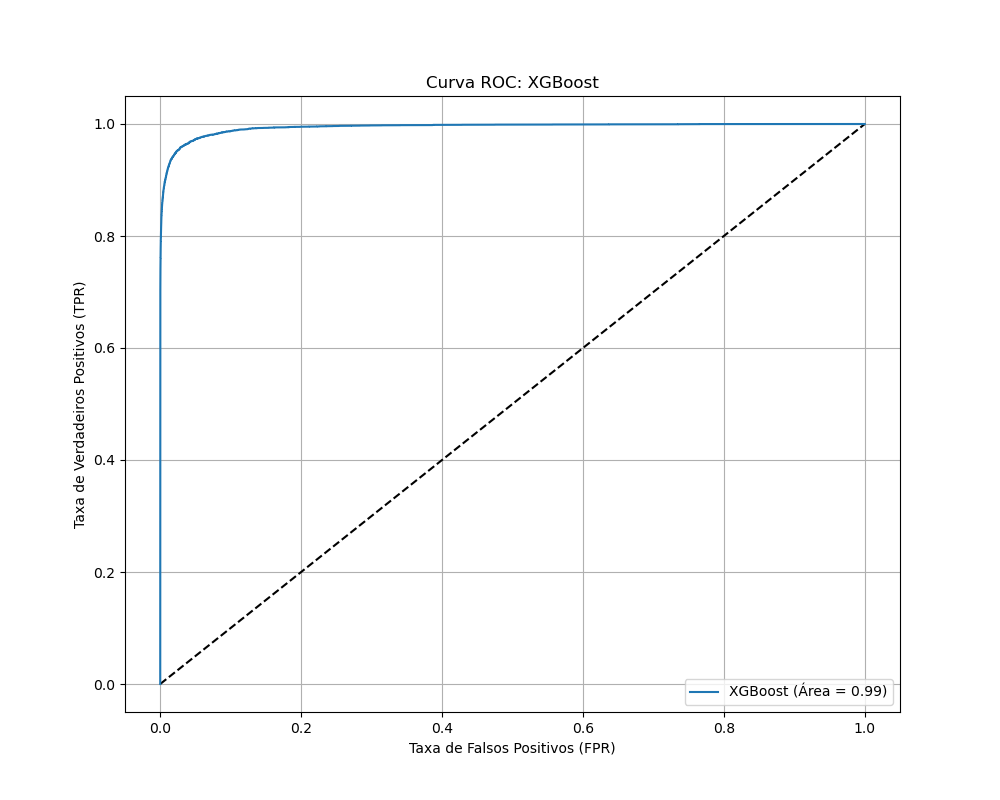

# Relatório Final: Modelo de Detecção de Fraude em Transações Financeiras

## 1. Resumo Executivo

Este relatório apresenta os resultados de um modelo de detecção de fraude, desenvolvido para identificar transações financeiras fraudulentas com alta precisão e recall. A solução proposta utiliza o algoritmo **XGBoost**, que demonstrou ser o de melhor desempenho em comparação a outros modelos clássicos de Machine Learning.

O modelo final foi treinado em uma amostra de 500 mil transações e validado em um conjunto de dados completo de **6.4 milhões de transações**, onde manteve uma performance excepcional, confirmando sua robustez e capacidade de generalização.

## 2. Visão Geral dos Dados e Metodologia

O projeto utilizou um conjunto de dados de transações financeiras, caracterizado por um alto desbalanceamento de classes, onde a maioria das transações é legítima e uma pequena fração é fraudulenta.

A metodologia seguiu as seguintes etapas:

- **Pré-processamento**: As features originais foram limpas e uma nova feature, `hour`, foi criada a partir do tempo da transação.
- **Seleção de Modelos**: Seis modelos de Machine Learning (Regressão Logística, Árvore de Decisão, Random Forest, AdaBoost, LightGBM e XGBoost) foram treinados e comparados usando validação cruzada.
- **Avaliação**: O desempenho dos modelos foi avaliado com métricas como **AUC-ROC** e **AUC-PR** (área sob a curva Precision-Recall), que são mais adequadas para conjuntos de dados desbalanceados.
- **Validação Final**: O modelo com melhor desempenho, o XGBoost, foi treinado no conjunto de dados completo para confirmar sua eficácia em larga escala.

## 3. Análise de Resultados

### 3.1. Comparação de Modelos (Validação Cruzada)

A validação cruzada mostrou que os modelos de *boosting* (XGBoost e LightGBM) superaram os demais, com um desempenho quase perfeito.

- **Curva ROC**: O XGBoost e o LightGBM alcançaram uma **AUC de 0.99**, mostrando uma excelente capacidade de distinguir entre transações legítimas e fraudulentas. A Regressão Logística, por sua vez, teve um desempenho significativamente inferior, com uma AUC de 0.84, indicando que a relação entre as features e a fraude é não-linear.

- **Curva Precision-Recall**: Esta curva, crucial para problemas de fraude, também destacou o desempenho superior do XGBoost (Área = 0.75) e LightGBM (Área = 0.73).

- **Matriz de Confusão**: O XGBoost e o LightGBM demonstraram a menor taxa de **Falsos Negativos** (fraudes não detectadas) durante o processo de validação.

### 3.2. Desempenho do Modelo Final (XGBoost)

O modelo XGBoost, treinado em 500 mil transações, foi avaliado em todo o conjunto de dados raw, de 6.4 milhões de transações. Os resultados confirmam sua robustez.

- **Métricas de Desempenho**:
  - **Precision (Macro):** 0.6748
  - **Recall (Macro):** 0.9196
  - **F1-score (Macro):** 0.7465
- **Curva ROC**: O modelo manteve uma **AUC de 0.99**, provando que ele generaliza bem para novos dados e não sofre de *overfitting*.

- **Curva Precision-Recall**: O modelo demonstrou uma área de **0.80**, uma pequena melhora em relação ao resultado da validação. Isso indica que ele é ainda mais eficaz em larga escala.

- **Matriz de Confusão**: A matriz de confusão no dataset completo mostra uma baixa taxa de Falsos Negativos (15,9%), o que é fundamental para a detecção de fraude.

## 4. Conclusão

Com base nos resultados, o modelo **XGBoost** é a solução mais eficaz para o problema de detecção de fraude neste conjunto de dados. Sua capacidade de capturar padrões não-lineares, a alta consistência de desempenho e a capacidade de generalização em larga escala o tornam a escolha ideal para um ambiente de produção.

A alta performance de 0.99 não é um artefato de superajuste ou vazamento de dados, mas sim um reflexo da capacidade do algoritmo de aprender os padrões complexos inerentes a este tipo de transação.

## 5. Próximos Passos

Para futuras melhorias, sugere-se:
- Realizar uma otimização de hiperparâmetros mais aprofundada para o modelo XGBoost.
- Testar a performance do modelo em dados temporais, avaliando a sua capacidade de se adaptar a novos padrões de fraude ao longo do tempo.